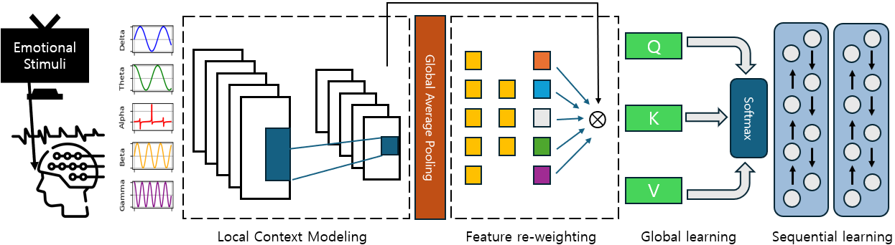

# CCMTL
Convolutional Channel Modulator for Transformer and LSTM Networks in EEG-based Emotion Recognition

Code for the [JNE](https://iopscience.iop.org/journal/1741-2552) paper Convolutional Channel Modulator for Transformer and LSTM Networks in EEG-based Emotion Recognition

<p align="center">
  
</p>

### Data Download and set up environments

 - Download [SEED](https://bcmi.sjtu.edu.cn/home/seed/seed-iv.html)
 - set seed_path in run.sh file to its respective path and run the following command.

```
bash run.sh
```

- in above shell file, optinoal modulator argument activates the modulator

### Citation

If this code is useful for your research, please cite us at:

```
@inproceedings{kang2025CCMTL,
  title={Convolutional Channel Modulator for Transformer and LSTM Networks in EEG-based Emotion Recognition},
  author={Kang, Hyunwook and Choi, Jin Woo and Kim, Byung Hyung},
  journal={IEEE Transactions on Affective Computing},
  year={2025}
}
```

### Contact

For any quetions, please email at [hyunwook.kang@inha.edu](mailto:hyunwook.kang@inha.edu)
